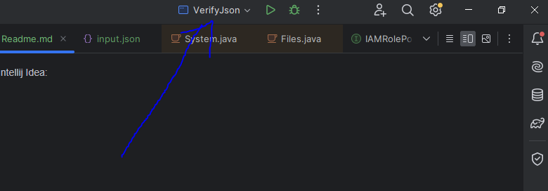

How to run using run configuration in Intellij Idea:
1. Clone this repository
2. Select VerifyJson as run configuration

3. Change input file path if needed.

How to build and run??
1. Clone repository
2. Run gradle clean task
3. Run gradle jar task

4. Go to verify-json\build\libs\
5. Grab verify-json-1.0-SNAPSHOT.jar
6. run java -jar verify-json-1.0-SNAPSHOT.jar input.json